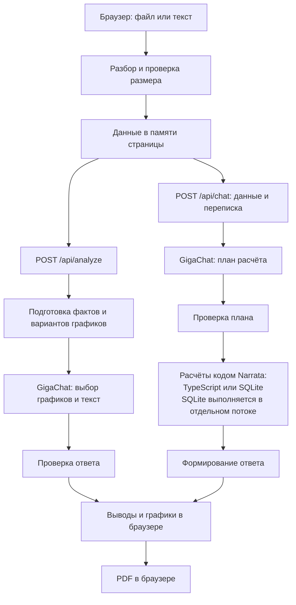

# Архитектура Narrata

## Общая схема

Схема показывает основной путь табличных данных. Для свободного текста используется отдельная обработка, описанная ниже. Стрелки к GigaChat означают внешние запросы: это не локальная модель.

Отдельный поток — задача внутри функции приложения на Vercel, которая выполняет SQL-расчёт. Если расчёт превышает лимит времени, эту задачу можно остановить и вернуть пользователю понятное сообщение.

## 1. Браузер: загрузка и состояние

**Файлы:** [app/page.tsx](../app/page.tsx), [lib/parse.ts](../lib/parse.ts), [lib/request-body.ts](../lib/request-body.ts).

- CSV разбирается через PapaParse, Excel — через SheetJS. Из Excel читается первый лист.
- Результат — объект Dataset: имя источника, колонки и строки; для вставленного текста — `rawText`.
- React хранит Dataset, результат анализа и переписку в памяти страницы. Состояния экрана: ожидание ввода, чтение, анализ, результат, ошибка.
- Перед отправкой проверяется размер JSON. При новом вопросе браузер снова отправляет Dataset и историю чата. Серверу не нужно хранить сессию.
- Обновление страницы очищает состояние. Сохранить результат можно в PDF.

## 2. Две серверные функции

**Файлы:** [analyze/route.ts](../app/api/analyze/route.ts), [chat/route.ts](../app/api/chat/route.ts), [validation.ts](../lib/validation.ts), [errors.ts](../lib/errors.ts).

| Маршрут | Вход | Результат |
| --- | --- | --- |
| `POST /api/analyze` | Dataset | Заголовок, абзац с выводами, описания графиков |
| `POST /api/chat` | `{ dataset, messages }` | `{ answer }` |

Обе функции проверяют входные данные и преобразуют ошибки в сообщения для интерфейса. Они выполняются на Vercel в Node.js. В конфигурации каждой функции указано `maxDuration = 60`; это настройка исполнения, а не обещание, что анализ всегда завершится за минуту.

## 3. Как строится анализ таблицы

**Файлы:** [analysis-plan.ts](../lib/analysis-plan.ts), [ai.ts](../lib/ai.ts), [narrative-context.ts](../lib/narrative-context.ts).

1. `prepareAnalysis` рассчитывает факты и формирует варианты графиков по строкам таблицы.
2. Модель определяет тему источника по имени файла, колонкам и примерам записей.
3. Модель выбирает графики из подготовленных вариантов. Код проверяет выбранные представления и разрешённые типы.
4. Для основного вывода передаются рассчитанные факты одной выбранной разбивки. Это уменьшает риск смешать независимые группы, например пол и класс билета.
5. Модель пишет заголовок и абзац. Отдельный запрос редактирует абзац, чтобы в нём была названа тема источника.
6. Проверяются числа, структура текста и упоминание контекста; модель отдельно проверяет обоснованность утверждений. После ошибки допускается ограниченное число исправлений.
7. Браузер получает описания графиков; Recharts отрисовывает их и показывает подсказки при наведении.

Один анализ включает несколько обращений к модели. Поэтому время ответа зависит от провайдера и количества исправлений. Проверка смысла тоже использует ИИ и может ошибаться.

## 4. Как работает вопрос к таблице

**Файлы:** [ai.ts](../lib/ai.ts), [table-query.ts](../lib/table-query.ts), [compute-query.ts](../lib/compute-query.ts), [comparison.ts](../lib/comparison.ts), [sql-query.ts](../lib/sql-query.ts), [sql-worker.ts](../lib/sql-worker.ts).

1. Для уточняющего вопроса вроде «А у Алжира?» модель использует переписку, чтобы восстановить полный вопрос.
2. Проверяется, есть ли нужные сведения в колонках или можно ли их вычислить. Отказ из-за отсутствия сведений перепроверяется.
3. Модели передаются схема, статистика, примеры и вопрос. Она возвращает структурированный план.
4. Простые поиск и сравнения выполняются средствами TypeScript. План `compute` компилируется в SQL. Для более сложных запросов используется SQL-план модели.
5. Перед выполнением проверяются поля и операции. Для сравнений дополнительно проверяются порядок групп и база расчёта процентов.
6. SQLite работает в памяти отдельного worker. Разрешены запросы чтения; изменение данных и несколько SQL-команд отклоняются. Лимит SQL-расчёта — 8 секунд, лимит old-generation heap worker — 192 МБ. Это не лимит всей памяти серверной функции.
7. Для формулировки ответа используются рассчитанные значения. В общей SQL-ветке модель пишет текст со ссылками вида `{{r0c0}}`, а код подставляет числа. Если текст не проходит проверку, используется программное представление результата.

### Пример: сравнение районов

Вопрос: «На сколько процентов в районе A меньше объектов, чем в районе B?»

План: посчитать строки для A и B, затем вычислить `100 × (B − A) / B`. При A = 3 и B = 6 результат — 50%. При обратном сравнении база меняется: `100 × (6 − 3) / 3 = 100%`.

Модель выбирает группы и действие. Программа выполняет подсчёт и формулу. Неверно выбранную моделью группу числовая проверка обнаруживает не всегда.

## 5. Что меняется для свободного текста

**Файлы:** [text-analysis.ts](../lib/text-analysis.ts), [ai.ts](../lib/ai.ts).

Текст разбивается на фрагменты. Для графиков модель выбирает ссылки на исходные числа и категории; проверяются их соответствие и структура ответа. Ответы чата должны содержать подтверждающие цитаты из источника. Процентное сравнение двух значений обрабатывается отдельно: модель выбирает факты, код выполняет расчёт.

SQL-таблица из произвольного текста автоматически не строится. Наличие цитаты подтверждает её присутствие в источнике, но само по себе не доказывает правильность вывода модели.

## 6. GigaChat и экспорт

**Файлы:** [gigachat.ts](../lib/gigachat.ts), [download-report.ts](../lib/download-report.ts), [report-document.ts](../lib/report-document.ts).

Ключ GigaChat хранится в переменных окружения сервера. `gigachat.ts` получает токен доступа и отправляет запросы модели по HTTPS с проверкой сертификата. Ключ не передаётся браузеру. Данные и контекст запросов передаются серверу и провайдеру модели.

PDF создаётся в браузере через pdfmake из текущего анализа, графиков и сообщений чата. Отдельная серверная функция для PDF не нужна.

## Почему так устроен MVP

- Next.js объединяет интерфейс и API в одном репозитории и одном деплое.
- Отчёт и чат хранятся в браузере, поэтому не нужны постоянная БД и учётные записи. Последствие — потеря сессии при обновлении страницы и повторная передача данных с вопросом.
- Модель выбирает операцию и пишет текст; расчёты выполняет код. Это позволяет тестировать формулы независимо от ответов модели.
- Контекст передаётся напрямую, без векторного индекса. Последствие — ограничения на размер запроса и объём контекста модели.
- Нет фоновой очереди задач. Анализ должен завершиться в пределах серверного запроса; при сбое пользователь запускает повторную попытку.
